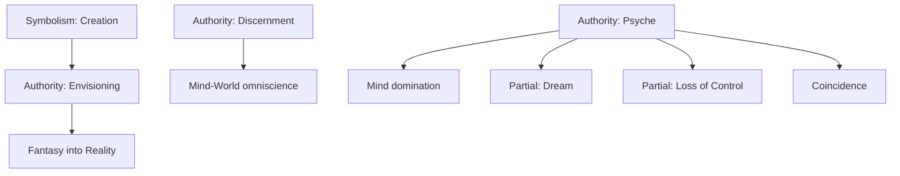
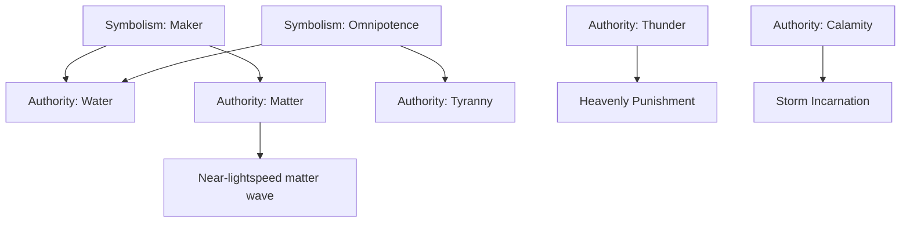
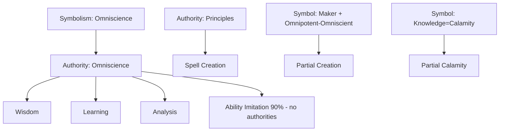
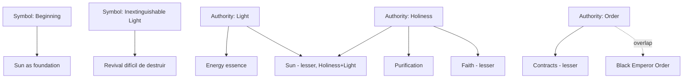
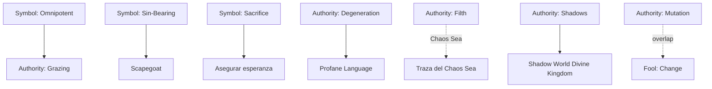
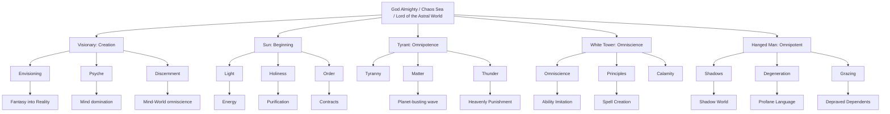

# Los Pathways del grupo God Almighty en *Lord of Mysteries* y *Circle of Inevitability*: análisis de Symbolisms, Authorities, Domains y Powers

## Metodología y fuentes

Este informe analiza los cinco Pathways del grupo **God Almighty** (Visionary, Tyrant, White Tower, Sun, Hanged Man). Se prioriza el texto de las novelas (citado por capítulo cuando la fuente lo indica), las notas del autor Cuttlefish That Loves Diving (posts de WeChat/Weibo citados por la wiki), y la Lord of the Mysteries Wiki de Fandom como agregador de esas referencias. Cada afirmación se clasifica como **Confirmado**, **Muy probable**, **Posible** o **Especulativo**. Se advierte que la wiki no es fuente primaria y que muchos sitios de terceros (lordofmysteriesgame.com, lord-of-the-mysteries.shop, geekchamp, techwiser, cbr) contienen resúmenes generados por IA o imprecisos que contradicen el canon. No se reproducen pasajes largos de las novelas; se parafrasea y se cita por capítulo.

## Definiciones

- **Symbolism (Símbolo/Simbolismo)**: concepto abstracto fundacional que un Pathway/Sefirah "es". No puede sellarse completamente; incluso con la Uniqueness o Sefirah sellada, el Symbolism persiste y las plegarias dirigidas a él obtienen respuesta (wiki Symbolism). Ejemplos: "Sin-Bearing", "Sacrifice", "Inextinguishable Light".
- **Authority (Autoridad/Divine authority)**: permiso o "concepto-permiso" que habilita a manipular un dominio de la realidad. La wiki White Tower cita que "authorities and symbolisms are more like the embodiment of permissions and concepts"; sin poseerlas, no pueden usarse aunque se conozca todo sobre ellas.
- **Partial authority (Autoridad parcial)**: control incompleto de un dominio; el Pathway posee solo una porción del concepto (ej. el Visionary tiene "partial authority over Dreams").
- **Shared / Corresponding authority (Autoridad compartida/correspondiente)**: cuando dos Pathways poseen porciones del mismo concepto o conceptos que se intersecan (ej. Order entre Sun y Black Emperor).
- **Domain (Dominio)**: el campo de realidad sobre el que actúa una Authority (Mind, Sea, Light, Shadow, Knowledge, etc.).
- **Power / Ability / Beyonder ability (Poder/Habilidad)**: la manifestación práctica y usable en una Sequence concreta (ej. Mind Reading, Purification, Storm Incarnation).
- **Uniqueness (唯一性)**: la característica única de un Pathway, ingrediente más importante para llegar a Sequence 0; la wiki señala que "Uniqueness is also referred to as the symbolism or authority of the corresponding Pathway".
- **Sequence 0 / True God**: cúspide de un Pathway estándar; se alcanza acomodando la Uniqueness y las tres Beyonder Characteristics de Sequence 1 del Pathway, obteniendo autoridad completa sobre él.
- **Above the Sequence / Great Old One**: nivel superior a Sequence 0; se convierte en representación directa de un aspecto del universo. Requiere acomodar el Sefirah correspondiente, todas las Uniquenesses y al menos una Beyonder Characteristic de Sequence 1 de cada Pathway del grupo (wiki Sefirot, Circle of Inevitability cap. 1089).
- **Sefirah (源质, "Source Quality")**: "collections of symbols, sources of authority, and origins of power". El del grupo God Almighty es el **Chaos Sea**.

Diferencias clave: un **Symbolism** es el concepto; una **Authority** es el permiso para usarlo; un **Power** es la aplicación concreta en una Sequence. Un **Domain** es más amplio que un conjunto de poderes: es el campo conceptual entero. El poder de una Sequence baja puede *anticipar* una Authority sin serlo aún (ej. Mind Reading de Sequence 9 anticipa la Psyche authority). **Advertencia**: el canon no impone una taxonomía simétrica; la propia wiki señala que "a Pathway having certain symbolism doesn't mean at the level of Above the Sequence that it entirely stems from that Pathway. It might stem from the entire group or certain parts from it".

### God Almighty: marco general

**God Almighty** (上帝, Shàngdì) es el título del Great Old One de los cinco Pathways; es uno de los Three Pillars, también llamado "The Omnipotent and Omniscient; Lord of the Astral World; Creator; Maker" (wiki God Almighty, LotM cap. 1347). Posee autoridad completa sobre los cinco Pathways. La imagen canónica: un gigante radiante cuya cabeza alcanza el Astral World, con el Chaos Sea bajo sus pies, una sombra de cinco cabezas tras de sí, un sol tras su cabeza, tormentas y rayos alrededor, y en sus manos una torre blanca de libros con ojos de latón (LotM cap. 1345/1376).

Reparto de Symbolisms al nivel de God Almighty (wiki God Almighty): Visionary → símbolo de **Creation**; Sun → símbolo de **Beginning**; Tyrant → **Omnipotence**; White Tower → **Omniscience**; Hanged Man → **Omnipotent**. El símbolo capital es **Lord of the Astral World** (símbolo de Pillar). Klein conjetura (LotM cap. 715) que los cinco son intercambiables porque representan aspectos de "The Omnipotent and Omniscient": White Tower = la parte "Omniscient"; Hanged Man = la parte "Omnipotent"; Tyrant = "Omnipotence" en mar, tierra y aire; Visionary = complemento sobre la psique; Sun = la base que acomoda "Omnipotent and Omniscient".

Detalle de acomodación (wiki God Almighty, LotM cap. 1345): para ser God Almighty completo se requieren el Chaos Sea, las Uniquenesses de los cinco Pathways y una Beyonder Characteristic de Sequence 1 de cada uno (Author del Visionary, White Angel del Sun, Thunder God del Tyrant, Omniscient Eye del White Tower, Dark Angel del Hanged Man). El camino más fácil según la investigación del Ancient Sun God: hacerse True God del Visionary o del Hanged Man y ganar control inicial del Chaos Sea (LotM cap. 1376). El Visionary tiene algo especial: puede "Envision" (crear) las Uniquenesses de otros Pathways para volverse temporalmente **Half a Great Old One** (Half-God Almighty), como hizo Adam (LotM cap. 1376).

---

## Visionary Pathway

**Sequence 0**: Visionary. **Tarot**: Justice. **Sefirah**: Chaos Sea. **Mythical Creature Form**: Mind Dragon (dragón gris-blanco con pupilas verticales doradas). **Símbolo oficial**: color alice blue, representa un dragón gigante. Especialidad: manipulación psicológica.

Secuencias (wiki Visionary): 9 Spectator, 8 Telepathist, 7 Psychiatrist, 6 Hypnotist, 5 Dreamwalker, 4 Manipulator, 3 Dream Weaver, 2 Discerner, 1 Author, 0 Visionary.

### Domains
- **Mind World / Psyche** (principal): incluye las Mind Islands individuales y el Sea of Collective Subconscious. El Visionary es su gobernante. **Confirmado** (wiki Abilities).
- **Dreams** (parcial): posee "partial Dream authority — the concept of Dreams itself". Frente a un Beyonder de Darkness del mismo nivel, su autoridad de Dreams se inclina a tejer sueños dirigidos a la mente. **Confirmado**.
- **Fate/Reality/Illusion** (extensión de Discernment): su Discernment puede extenderse a estos dominios. **Confirmado**.
- **Astral World** (tocado por Envisioning): Envisioning "también toca el Astral World" y puede traer conceptos a la realidad temporalmente. **Confirmado**.

### Symbolisms
- **Creation** (a nivel God Almighty): "the one who creates existence and concepts through Their imagination". Es el símbolo que el Visionary aporta a God Almighty. **Confirmado**.
- La Uniqueness del Visionary permite en Sequence 0 extraer dos de las tres características de Sequence 1 y reemplazarlas por características imaginadas (LotM cap. 1346) — de ahí que Dragon of Nightmares Alzuhod fuese Sequence 1 y Dragon of Imagination Ankewelt fuese Sequence 0.

### Authorities
1. **Psyche (Mind)** — dominio de todos los reinos mentales. Manifestación: dominación de la psique de todo ser vivo sin que lo noten. **Confirmado**.
2. **Discernment** — como gobernante del Mind World, "puede ser, en cierto sentido, Omniscient, pero limitado a lo relacionado con el Mind World". Frente al Visionary no hay secretos: cualquier plan se ve y oye claramente. Puede penetrar Anti-Divination/Anti-Prophecy normales; a veces penetra y a veces es bloqueado por Concealment, Deceit y Fooling (se restringen mutuamente). **Confirmado**.
3. **Envisioning (Fantasy into Reality)** — porción de la autoridad; involucra Psyche, Sea of Collective Subconscious y Astral World; puede materializar lo imaginado. Base del estado Half-God Almighty. **Confirmado**.
4. **Dream** (parcial). **Confirmado**.
5. **Loss of Control** (parcial): "the collapse of one's Psyche often marks the beginning of Loss of Control". **Confirmado**.
6. **Coincidence** (derivada del control preliminar del Sea of Collective Subconscious por el Author): convierte fenómenos aparentemente accidentales en ecos de la mente. **Confirmado** (Sequence 1).

### Powers by Sequence
```
Psyche (Core)
├── Mind Reading / emotion sensing (Seq 9 Spectator)
├── Telepathy / mental influence (Seq 8 Telepathist)
├── Psychoanalysis, mental healing (Seq 7 Psychiatrist)
├── Hypnosis (Seq 6 Hypnotist)
├── Dream travel/manipulation (Seq 5 Dreamwalker)
├── Mental domination sin ser notado, Psychological Invisibility (Seq 4 Manipulator)
├── Dream weaving realista, virtual personas, Dream Maze (Seq 3 Dream Weaver)
├── Discernment pleno, Dream Maze de interrogación (Seq 2 Discerner)
└── Envisioning + Coincidence + control del Sea of Collective Subconscious (Seq 1 Author)
```
El Author creó el Dreamscape Garden of Eden (sede de los Psychology Alchemists). Nota canónica: la Lord of the Mysteries Wiki (Visionary Pathway) recoge textualmente que "Medici once said that high-level Beyonders of the Visionary Pathway is the hardest to lose control or go crazy, but it's also the easiest to lose control and go crazy" (LotM cap. 1074) — es decir, son a la vez los más resistentes y los más frágiles frente al Loss of Control, por su capacidad de auto-analizarse y auto-sanar.

### Conceptual map


---

## Tyrant Pathway

**Sequence 0**: Tyrant. **Tarot**: The Hierophant. **Sefirah**: Chaos Sea. **Mythical Creature Form**: criatura marina con tentáculos (pulpo envuelto en rayos). **Símbolo**: dark blue, símbolo de Windstorm. Especialidad: agua y clima; "omnipotent in the sea, land, and air domains" (LotM cap. 715).

Secuencias: 9 Sailor, 8 Folk of Rage, 7 Seafarer, 6 Wind-blessed, 5 Ocean Songster, 4 Cataclysmic Interrer, 3 Sea King, 2 Calamity, 1 Thunder God, 0 Tyrant.

### Domains
- **Sea / Water** (principal): abarca el mar y parte de la vida acuática; el Water domain incluso alcanza el Sea of Collective Subconscious, Chaos Sea, Spiritual Sea, River of Eternal Darkness y River of Fate — aunque algunos solo indirectamente y con influencia baja (wiki God Almighty). **Confirmado**.
- **Storms / Weather / Wind** (principal). **Confirmado**.
- **Calamity (天灾, desastres naturales)** (parcial): tormentas eléctricas, ventiscas, tsunamis, capaces de destruir puertos o islas. **Confirmado**.
- **Thunder/Lightning** (principal en Sequence 1 Thunder God). **Confirmado**.
- **Matter** (deriva del Maker symbol, interseca con Thunder): conversión materia↔energía, fuerzas electromagnética/fuerte/débil; aceleración de materia cerca de la velocidad de la luz. **Confirmado**.

### Symbolisms
- **Omnipotence** (a nivel God Almighty): el Tyrant es "Omnipotence en mar, tierra y aire". **Confirmado**.
- **Tyrant/Tyranny**: dominación por miedo y sumisión. **Confirmado**.
- **Maker**: de él derivan parcialmente Water y Matter. **Confirmado**.

### Authorities
1. **Tyranny** — aura que hace temblar en miedo, awe y sumisión; puede detener la posesión de un Beyonder del Chained Pathway, repelerlo y quitarle la invisibilidad; borra Calamities circundantes. **Confirmado**.
2. **Water** — intersección de Maker y Omnipotence; mares y vida acuática. **Confirmado**.
3. **Thunder/Lightning** — "Heavenly Punishment": rayo masivo con Disintegration, Purification y Destruction; muy potente contra Darkness, Death, Corruption, Filth. **Confirmado**.
4. **Wind**. **Confirmado**.
5. **Calamity** (parcial) — "Descent of Calamity", "Storm Incarnation". **Confirmado**.
6. **Matter** — acelera materia al límite de velocidad creando una "ola" capaz de destruir un planeta; se transforma en ball lightning que cae del Astral World a velocidad cercana a la luz. A diferencia del Sun (que se mueve a la velocidad de la luz sin masa), el Tyrant lo hace conservando masa. **Confirmado**.

Reino divino: **Fearful Paradise** (Sole Obedience to the Storm, enfatiza el símbolo Tyrant) y **Chasm of Storms** (Thunder y Calamity).

### Powers by Sequence
```
Storm/Sea (Core)
├── Fuerza en agua, escamas resbaladizas (Seq 9 Sailor)
├── Furia/berserk + rayos menores (Seq 8 Folk of Rage)
├── Control de olas, criaturas marinas (Seq 7 Seafarer)
├── Control de viento, planeo, vuelo breve (Seq 6 Wind-blessed)
├── Canto que incapacita, control oceánico (Seq 5 Ocean Songster)
├── Creación de calamidades/terremotos (Seq 4 Cataclysmic Interrer)
├── Rey del mar, responde plegarias, navegación infalible (Seq 3 Sea King)
├── Authority de Calamity: congelación de área (Seq 2 Calamity)
├── Authority sobre Thunder/Wind/Calamity, Heavenly Punishment (Seq 1 Thunder God)
└── Tyranny + Matter: Omnipotencia en mar/tierra/aire (Seq 0 Tyrant)
```

### Conceptual map


---

## White Tower Pathway

**Sequence 0**: White Tower. **Tarot**: The Tower. **Sefirah**: Chaos Sea. **Mythical Creature Form**: torre ilusoria de libros con ojos de latón; forma pináculo = estantería espiral con todo el conocimiento, coronada por un Omniscient Eye. Representa la búsqueda de conocimiento (científico y místico), a diferencia de Hermit/Paragon.

Secuencias (wiki inglesa/Baidu): 9 Reader, 8 Reasoning Apprentice, 7 Keeper of Knowledge, 6 Scholar, 5 Mystic Mentor, 4 Prophet, 3 Sage, 2 Angel of Wisdom, 1 All-Knowing Eye (Omniscient Eye), 0 White Tower. (Nota: los nombres de sitios comerciales como "Rune Mage", "Polymath", "God of Wisdom" son traducciones no oficiales/inexactas.)

### Domains
- **Knowledge / Information** (principal). **Confirmado**.
- **Omniscience** (principal, parcial hasta Sequence 0): en Sequence 1 el Omniscient Eye tiene "partial authority over Omniscience as the monitoring of Information". **Confirmado**.
- **Astral World Ladder** (dominio propio): simboliza las capas de conocimiento que llevan a lo más esencial del universo y a los peligros más fundamentales. **Confirmado**.
- **Principles (规律)** (dominio): patrones/leyes naturales subyacentes de la realidad. **Confirmado**.

### Symbolisms
- **Omniscience** (a nivel God Almighty). **Confirmado**.
- **"Knowledge leads to Calamity/disaster"**: según el autor, en la cosmovisión de la obra "knowledge equals disaster and danger". Es la base del ritual de apoteosis (sobrevivir a una calamidad de un ser más allá de Sequence 0). **Confirmado**.

### Authorities
1. **Omniscience** — percibe información de casi todo sin depender del Spirit World; observa pasado, presente y futuros posibles, secretos, debilidades y fallos explotables de un objetivo. **Confirmado**.
2. **Wisdom** (parcial) — dar la guía más sabia y tomar las decisiones más sabias. **Confirmado**.
3. **Learning** (parcial, derivada de Omniscience y Wisdom). **Confirmado**.
4. **Analysis** (parcial, derivada de Omniscience y Wisdom). **Confirmado**.
5. **Principles** — comprender las leyes fundamentales de la realidad y crear hechizos usables por otros. **Confirmado**.
6. **Creation** (parcial, de los símbolos Maker y The Omnipotent and Omniscient) — "The Omniscient White Tower can naturally Create anything, but it cannot escape the symbolisms and authorities that do not belong to Them". **Confirmado**.
7. **Calamity** (parcial) — inflige Madness y Destruction, pues cierto conocimiento encarna esos símbolos. **Confirmado**.
8. **Astral World Mentor** — modifica temporalmente y en alcance limitado un concepto del Astral World, haciendo que una acción falle, produzca error o se amplifique (ej. redefinir "Water" en el Sea of Collective Subconscious o en el Chaos Sea para inutilizarlo al Tyrant). **Confirmado**.

**Límite crucial (Ability Imitation)**: el White Tower puede imitar cualquier habilidad o efecto de hechizo que entienda hasta el 90% de la potencia del original (la Lord of the Mysteries Wiki, White Tower Pathway/Abilities, lo formula textualmente: "Imitated abilities and Spell effects can reach 90% of the original's potency"), y puede optimizarla, **pero no puede reproducir authorities ni symbolisms**. La misma wiki (Door Pathway/Abilities) lo confirma como regla general: "Normally, it's impossible to copy authorities, and that's why the Hermit's Knowledge authority and White Tower's Imitation can't simulate one." **Confirmado** (queda descartado el supuesto conflicto "90% vs 100%": la cifra canónica es 90% de potencia para *habilidades*, con imposibilidad absoluta para *authorities*).

### Powers by Sequence
```
Knowledge/Analysis (Core)
├── Lectura veloz, memoria mejorada, Ritualistic Magic (Seq 9 Reader)
├── Razonamiento/observación mejorados (Seq 8 Reasoning Apprentice)
├── Dominio de conocimiento, Ritualistic Magic experto (Seq 7 Keeper)
├── Aprendizaje/imitación por análisis (Seq 6 Scholar)
├── Conocimiento místico profundo (Seq 5 Mystic Mentor)
├── Prophecy, ver el futuro (Seq 4 Prophet)
├── Sabiduría vasta, predicción (Seq 3 Sage)
├── Authority de Wisdom, elegir la acción más correcta (Seq 2 Angel of Wisdom)
├── Partial Omniscience, Astral World Mentor (Seq 1 All-Knowing Eye)
└── Omniscience, Principles, Creation, Calamity (Seq 0 White Tower)
```

### Conceptual map


---

## Sun Pathway

**Sequence 0**: Sun (Eternal Blazing Sun es el actual). **Tarot**: The Sun. **Sefirah**: Chaos Sea. **Mythical Creature Form**: Sunbird envuelto en llamas doradas. **Símbolo**: golden yellow, reflejo del Sol. Especialidad: luz, magia sagrada, purificación, contratos.

Secuencias: 9 Bard, 8 Light Supplicant, 7 Solar High Priest, 6 Notary, 5 Priest of Light, 4 Unshadowed, 3 Justice Mentor, 2 Lightseeker, 1 White Angel, 0 Sun.

### Domains
- **Light** (principal): "wherever Light exists, They exist"; esencia de Energy, piedra angular de la energía de The Omnipotent and Omniscient. **Confirmado**.
- **Holiness** (principal): purifica toda disonancia. **Confirmado**.
- **Order** (principal): versión positiva, autocentrada, exclusiva, derivada del propio estándar de Justice. **Confirmado**.
- **Purification** (dominio funcional central del Unshadowed): la Lord of the Mysteries Wiki (Sun Pathway/Abilities, Seq 4 Unshadowed, LotM cap. 1032) lo describe textualmente: "An Unshadowed can directly Purify any kind of Degeneration, Corruption, Corrosion, Darkness, Evil, Aliments... They can directly Purify a Beyonder, taking 1 hour to lower their Sequence by 1. With 6 hours, they can turn even a Saint to a normal person." **Confirmado**.
- **Sun** (dominio derivado de fusión Holiness+Light). **Confirmado**.

### Symbolisms
- **Beginning** (a nivel God Almighty). **Confirmado**.
- **Inextinguishable Light**: difícil de destruir del todo; incluso aniquilado, la resurrección es posible; The Omnipotent and Omniscient puede volver más fácilmente vía el Sun (Sun Seq 0). **Confirmado**.
- **Energy**: el Light es la esencia de la Energy. **Confirmado**.

### Authorities
1. **Light** — ilumina y destruye todo; base de Energy. **Confirmado**.
2. **Holiness** — purifica toda disonancia; potencia todo acto de santidad. **Confirmado**.
3. **Order** — **hay overlap e intersección con la Order authority del Black Emperor Pathway** (Sun Seq 0 abilities, WeChat del autor). La versión del Sun deriva del estándar de Justice previo; es "more positive, self-centered, and exclusive". La Distortion del Black Emperor puede suprimir los principios de Justice del Sun. **Confirmado**.
4. **Contracts** (lesser authority derivada de Order): una vez firmado un contrato, incluso Great Old Ones que carezcan del Symbolism correspondiente quedan severamente restringidos (Circle of Inevitability cap. 1138; Sun Seq 0). **Confirmado**.
5. **Faith** (lesser authority derivada de Holiness). **Confirmado**.
6. **Sun** (lesser authority de fusión Holiness+Light). **Confirmado**.

**Punto crítico (verificado)**: el Sun **NO posee una verdadera Life authority**. La "curación" es realmente Purification + auto-mantenimiento extraído de Order (Incarnation of Order del White Angel) + buffs. El título "Father of all Life" del Eternal Blazing Sun es explícitamente propaganda de su Iglesia: la Lord of the Mysteries Wiki (Eternal Blazing Sun) lo formula textualmente — "The Eternal Blazing Sun also has the title: 'Father of all Life所有生灵的父亲' but it's just something used by 'His' Church when proselytizing. It's beyond 'Him' in mysticism." La creación de vida genuina (Mother Pathway) es **inmune a Purification**. **Confirmado**.

### Powers by Sequence
```
Light/Purification (Core)
├── Singing con buffs (Seq 9 Bard)
├── Hechizos de Light/Fire, Daytime, detección del mal (Seq 8 Light Supplicant)
├── Sun Halo, Holy Water, Purification/Exorcism (Seq 7 Solar High Priest)
├── Notarization: Authentication/Amplification/Nullification (Seq 6 Notary)
├── Purification de área potenciada (Seq 5 Priest of Light)
├── Purification directa (baja Sequences, separa Beyonder Characteristics), Unshadowed Domain, Flaring Sun (Seq 4 Unshadowed)
├── Justice, Justice Halo, Judgment of Justice, Holy Contract (Seq 3 Justice Mentor)
├── Authority sobre Sun & Light, Spear of Light, Solar Envoy a velocidad de la luz (Seq 2 Lightseeker)
├── Authority sobre Holiness/Order/Faith, Holy Kingdom (anula revival del Darkness), Pure White Light (Seq 1 White Angel)
└── Light/Holiness/Order/Contracts/Faith/Sun completas (Seq 0 Sun)
```

### Conceptual map


---

## Hanged Man Pathway

**Sequence 0**: Hanged Man. **Tarot**: The Hanged Man. **Sefirah**: Chaos Sea. **Mythical Creature Form**: sombra negra y carne retorcida con cinco cabezas; forma pináculo = sombra fluyente tras una cortina oscura. Mayor Spirituality del grupo. Representa Degeneration pero también sacrificio y responsabilidad en sentido positivo (LotM cap. 567). Es la parte "Omnipotent" de "Omnipotent and Omniscient" (puede Graze otros Pathways, de ahí que resulte omnisciente por ser omnipotente, intercambiable con White Tower).

Secuencias: 9 Secrets Suppliant, 8 Listener, 7 Shadow Ascetic, 6 Rose Bishop, 5 Shepherd, 4 Black Knight, 3 Trinity Templar, 2 Profane Presbyter, 1 Dark Angel, 0 Hanged Man. (Nota: los sitios comerciales que listan "Corpse Collector / Gravedigger / Spirit Medium" para el Hanged Man son **incorrectos**: confunden este Pathway con el Death Pathway.)

### Domains
- **Shadow** (parcial; en Sequence 0 gobierna todo el Shadow World como Divine Kingdom). Las sombras tienen algo de Concealment inherente. **Confirmado**.
- **Darkness** (parcial): oscuridad devoradora que corrompe el corazón, distinta de la del Darkness Pathway. **Confirmado**.
- **Degeneration/Depravity** (principal): es la naturaleza degenerada de todo ser vivo. **Confirmado**.
- **Filth (污秽)** (parcial): la Lord of the Mysteries Wiki (Hanged Man Pathway) lo señala como rasgo distintivo del grupo — "among the five Pathways, only the Hanged Man has an Authority related to Chaos—the Authority of Filth that signifies 'Them' being tainted by the Chaos Sea and are capable of projecting traces of the Chaos Sea's influence." Es la razón de que el Primordial Hunger priorice este Pathway. **Confirmado**.
- **Mutation** (parcial): influye en el cambio de todas las cosas, lo que "partially overlaps with the authority of the Fool". **Confirmado**.

### Symbolisms
- **Omnipotent** (a nivel God Almighty). **Confirmado**.
- **Sin-Bearing (Scapegoat)**: asumir daño, muerte, culpa o castigo de otros. **Confirmado**.
- **Sacrifice**: autodestruirse para asegurar esperanza o un resultado deseado. **Confirmado**.

### Authorities
1. **Shadows (Lord of Shadows)** — gobierno del Shadow World; sombras con Concealment. **Confirmado**.
2. **Darkness** — océano negro viscoso que traga y anula ataques; puede tragar la luz plateada de un Silver Knight o el Flaring Sun de un Unshadowed. **Confirmado**.
3. **Degeneration/Depravity** — hace surgir una sombra en la espalda del objetivo; nadie puede separarse de su naturaleza degenerada salvo altos Beyonders (ej. Angel of Redemption). **Confirmado**.
4. **Filth** (parcial). **Confirmado**.
5. **Mutation** (parcial). **Confirmado**.
6. **Corruption** (parcial). **Confirmado**.
7. **Grazing** — "pastar" almas (hasta 22 en Dark Angel) y usar sus poderes. La Lord of the Mysteries Wiki (Hanged Man Pathway/Abilities) lo formula textualmente: "Depraved Dependents: 'They' can make released Grazed Souls into temporary followers, up to 22 Souls, but at the same time, they are affected by the Degeneration authority and will obey the Dark Angel's orders wholeheartedly as well as retain their full original abilities." Divine Grazing absorbe almas, características y símbolos superiores cuando existe la conexión espiritual requerida. **Confirmado**.
8. **Profane Language** — manifestación de Degeneration y Filth; arma las palabras/respuestas del objetivo para imponer efectos tipo word-spirit (imprisonment, Corruption, separation); cualquier acción de "exchange" o "communication" puede verse afectada. **Confirmado**.

Nota canónica: la Lord of the Mysteries Wiki (Hanged Man Pathway) atribuye a Klein, con referencia a LotM cap. 1155, que este es el Pathway más fácil de descontrolar y enloquecer — "Nothing came close; even the Abyss Pathway, which represented evil, was slightly lacking."

### Powers by Sequence
```
Shadow/Flesh/Sacrifice (Core)
├── Alta Spirituality, Ritualistic Magic, divination básica, conocimiento de sacrificios (Seq 9 Secrets Suppliant)
├── Escuchar susurros ocultos (Seq 8 Listener)
├── Concealment en sombras, ascetismo (Seq 7 Shadow Ascetic)
├── Ritos de redención, mística sacrificial (Seq 6 Rose Bishop)
├── Grazing de almas, pastoreo de fe, combinar poderes (Seq 5 Shepherd)
├── Caballero oscuro con armadura maldita (Seq 4 Black Knight)
├── Trinity (manipular carne/sangre), responde plegarias (Seq 3 Trinity Templar)
├── Profane Language, Degeneration/Corruption, Graze hasta 18 almas (Seq 2 Profane Presbyter)
├── Darkness authority, Graze 22 almas, Depraved Dependents (Seq 1 Dark Angel)
└── Shadows/Degeneration/Filth/Mutation/Corruption + Sin-Bearing + Sacrifice (Seq 0 Hanged Man)
```

### Conceptual map


---

## Shared Authorities and Overlapping Domains

| Authority/Domain | Manifestación principal | Manifestación parcial/análoga | Diferencia clave | Clasificación | Confianza |
|---|---|---|---|---|---|
| **Mind / Dreams** | Visionary (Psyche, Mind World) | Fool (Fooling, símbolo "Blind Stupidity" en Mind Domain — "overlaps with the Mind authority of the Visionary"); Darkness (Dreams) | Visionary domina el Mind World real; Fool solo influye mentes volviendo falso en real; Darkness enfoca sueños nocturnos | Superposición canónica (Fool-Visionary explícita); Authority parcial (Darkness-Dreams) | Confirmado |
| **Omniscience / Knowledge** | White Tower (Omniscience) | Visionary (Discernment = "omniscient limitado al Mind World"); Hermit/Paragon (Knowledge/Information bajo Demon of Knowledge); Hanged Man (omnisciente por ser omnipotente vía Grazing) | White Tower = conocimiento sin límite de dominio; Visionary limitado a mente; Hermit/Paragon = información mística vs. realidad; Hanged Man llega por otra vía | Authority principal (White Tower); análogos con origen distinto | Confirmado |
| **Concealment** | Fool/Door/Darkness | Hanged Man (sombras con Concealment inherente) | El Concealment del Hanged Man es efecto secundario de Shadow, no autoridad de Concealment propia | Resultado similar con origen distinto | Muy probable |
| **Calamity/Disaster** | Tyrant (天灾), Demoness/Red Priest (Calamity of Destruction) | White Tower (parcial, "Knowledge=Calamity") | Tyrant = desastre ambiental físico; White Tower = madness/destruction vía conocimiento; Demoness/Red Priest = desastre natural/humano | Authority parcial compartida (Tyrant-White Tower); análogo (Calamity of Destruction) | Confirmado |
| **Order** | Sun / Black Emperor | — | "overlap and intersection in the authority of Order between Black Emperor and Sun"; la del Sun deriva de Justice, positiva/exclusiva | Superposición canónica explícita | Confirmado |
| **Degeneration/Corruption** | Hanged Man (Degeneration) / Abyss (crea el entorno que degenera) | Sun (Purification lo contrarresta) | Hanged Man = naturaleza degenerada inherente; Abyss = entorno que induce y crea degeneración | Authorities separadas, temáticamente vecinas (relación de vecindad oculta Hanged Man–Abyss) | Confirmado |
| **Light vs Darkness/Death** | Sun (Light/Purification) | Hanged Man/Darkness (Darkness); Death (undead) | Sun purifica lo incompatible con la realidad; Holy Kingdom anula el revival del Darkness Pathway | Antagonismo (contramedida), no autoridad compartida | Confirmado |
| **Matter/Acceleration** | Tyrant (Matter, conserva masa) | Sun (Solar Envoy, velocidad de la luz sin masa) | Tyrant conserva masa; Sun no tiene masa | Resultado similar con origen distinto | Confirmado |
| **Mutation/Change** | Hanged Man (Mutation) | Fool (Change/Reassembly) | "partially overlaps with the authority of the Fool" | Superposición discutida (parcial) | Confirmado |

**Concealment auténtico vs. efectos parecidos**: el canon distingue el Concealment de Fool/Door/Darkness de: ocultamiento espacial (Door), sombra (Hanged Man), secreto, corrupción, interferencia informativa, y la Psychological Invisibility del Visionary (que puede ser bloqueada por Key of Stars, Attendant of Mysteries o Servant of Concealment). El Discernment del Visionary y el Concealment "se restringen mutuamente".

## God Almighty Group Comparison

| Capacidad | Detalle | Categoría |
|---|---|---|
| Dominación de la mente / Mind World | Psyche, Discernment, sueños, personas virtuales | **Visionary únicamente** |
| Envisioning (fantasía→realidad) | Materializar lo imaginado; base de Half-God Almighty | **Visionary únicamente** |
| Control de mar/clima/tormenta/rayo | Tyranny, Water, Thunder, Wind, Calamity | **Tyrant únicamente** |
| Aceleración de materia conservando masa | Onda destructora de planetas | **Tyrant únicamente** |
| Omniscience/Knowledge/Analysis/Imitation | Imita habilidades (90%, no authorities), Principles, Astral World Mentor | **White Tower únicamente** |
| Purification/Light/Holiness/Order/Contracts | Purifica degeneración/corrupción/oscuridad; contratos vinculantes | **Sun únicamente** |
| Shadow/Degeneration/Grazing/Sacrifice/Sin-Bearing/Profane Language | Pastar almas, corromper, sombra, sacrificio | **Hanged Man únicamente** |
| Prophecy / ver futuros | White Tower (Prophet), Visionary (proclamar futuros que se cumplen) | **Compartido (2+)** |
| Calamity | Tyrant (天灾) + White Tower (parcial) | **Compartido (2+)** |
| Creation | Visionary (Envisioning), White Tower (parcial de Maker) | **Compartido (2+)** |
| Control del Chaos Sea, símbolo Lord of the Astral World, barrera prismática que resiste a los cinco Pathways | Solo tras acomodar Sefirah+Uniquenesses+Seq1 de cada uno | **Completado únicamente por God Almighty** |
| Omnipotencia+Omnisciencia plena; suprimir a los True Gods dentro de sus Divine Kingdoms | Demostrado por Adam como Half-God Almighty (LotM cap. 1376-1380) | **Completado únicamente por God Almighty** |

Aporte de cada Pathway a God Almighty: Visionary → Creation/mente + capacidad de Envision Uniquenesses (vía más fácil a Half-God Almighty); Sun → Beginning/base energética; Tyrant → Omnipotence en mar/tierra/aire; White Tower → Omniscience; Hanged Man → Omnipotent + conexión única con el Chaos Sea (Filth), prioridad del Primordial Hunger.

## Master Symbolism → Authority → Power Map



Distinciones de tipo de vínculo:
1. **Authority de un solo Symbolism**: Psyche ← Mind (Visionary).
2. **Authority de varios Symbolisms**: Sun authority ← Holiness + Light; Creation ← Maker + The Omnipotent and Omniscient (White Tower).
3. **Authority como extensión conceptual**: Faith ← Holiness; Contracts ← Order; Learning/Analysis ← Omniscience+Wisdom.
4. **Authority heredada del grupo/God Almighty**: Lord of the Astral World; barrera prismática.
5. **Authority con relación simbólica no explicada del todo**: Filth (Hanged Man) y su vínculo con Chaos — canónica pero de origen conceptual solo parcialmente expuesto.
6. **Authority canónica de origen simbólico no confirmado**: Loss of Control (Visionary) — se describe la manifestación pero no un símbolo raíz explícito ("origen simbólico no confirmado").
7. **Poder que expresa varias Authorities**: Heavenly Punishment (Thunder + Purification + Destruction/Calamity); Solar Envoy (Light + Sun).
8. **Poder con Authority principal e influencias secundarias**: Justice Halo (Order/Justice con Purification).

## Uncertainties and Disputed Interpretations

- **Nombres de Sequence del White Tower**: hay dos conjuntos circulando. La wiki inglesa/Baidu dan Reader → Reasoning Apprentice → Keeper of Knowledge → Scholar → Mystic Mentor → Prophet → Sage → Angel of Wisdom → All-Knowing Eye → White Tower. Sitios comerciales usan "Rune Mage / Polymath / God of Wisdom" — **traducciones no oficiales**. Confianza en el primer conjunto: Muy probable.
- **Ability Imitation del White Tower**: el supuesto conflicto "90% vs 100%" queda **resuelto**: la propia Fandom Wiki fija 90% de potencia para *habilidades y hechizos*, con imposibilidad total de copiar *authorities* (confirmado también en Door Pathway/Abilities). Confianza: Confirmado.
- **"Life/healing" del Sun**: sitios de terceros afirman curación/resurrección; el canon lo niega — solo Purification + auto-mantenimiento vía Order + buffs. El "Father of all Life" es propaganda eclesial. Confianza: Confirmado que NO hay Life authority.
- **Sun como "foundation"**: Klein deduce que es *la* base (LotM cap. 715), pero el autor aclara que fue solo la base del Ancient Sun God; cualquiera de los cinco podría serlo. No es contradicción, sino matiz.
- **Nombres de baja Sequence del Hanged Man**: sitios comerciales listan "Corpse Collector/Gravedigger/Spirit Medium" — esto es **incorrecto** (confunde con Death Pathway). El canon: Secrets Suppliant → Listener → Shadow Ascetic → Rose Bishop → Shepherd → Black Knight → Trinity Templar → Profane Presbyter → Dark Angel → Hanged Man.
- **Grokipedia y sitios agregadores**: contienen mezcla de canon e inferencia; no tratados como primarios.
- **Vecindad Hanged Man–Abyss / Demoness**: relación de vecindad "oculta" no adyacente — canónica pero de mecánica compleja.

## Conclusions

Los cinco Pathways de God Almighty no son cinco "elementos" simétricos sino cinco aspectos de un único concepto dual: **"The Omnipotent and Omniscient"**. White Tower encarna lo Omniscient; Hanged Man y Tyrant lo Omnipotent (abstracto y físico respectivamente); Visionary aporta la dimensión de la mente y la Creation (más el don único de Envisioning que lo hace la vía más fácil hacia Half-God Almighty); Sun aporta Beginning y la base energética (Light=Energy). Sus Authorities se reparten y a veces se intersecan dentro del grupo (Creation entre Visionary y White Tower; Calamity entre Tyrant y White Tower), y con Pathways externos (Order con Black Emperor; Mind con Fool; Mutation con Fool). El canon insiste en que a nivel Above the Sequence un Symbolism puede no provenir enteramente de un solo Pathway sino del grupo entero, por lo que no debe forzarse una taxonomía rígida.

La mayoría de las capacidades cosmológicas plenas (control del Chaos Sea, Lord of the Astral World, supresión de True Gods) solo se completan al nivel Great Old One. Recomendación para el lector/analista: tratar los mapas Symbolism→Authority→Power como aproximaciones con incertidumbre declarada, verificar siempre contra el texto de la novela citado por capítulo, y desconfiar de sitios comerciales/IA que atribuyen al Sun poderes de vida o confunden las secuencias del Hanged Man con las de Death. Los cuatro puntos de mayor solidez canónica son: (1) el reparto de Symbolisms al nivel de God Almighty; (2) el don único de Envisioning del Visionary; (3) el límite de imitación del White Tower (habilidades sí, authorities no); (4) la inexistencia de una Life authority real en el Sun.

## Sources

- Lord of the Mysteries Wiki (Fandom): God Almighty; Visionary/Tyrant/White Tower/Sun/Hanged Man Pathway y sus subpáginas /Abilities y /Advancement; Symbolism; Uniquenesses; Sefirot; Above the Sequence; Gods; Chaos Sea; Primordial God Almighty; Eternal Blazing Sun; Fool Pathway/Abilities; Door Pathway/Abilities; Hermit Pathway; Demon of Knowledge; Darkness Pathway; Abyss Pathway/Abilities; Pathways.
  - https://lordofthemysteries.fandom.com/wiki/God_Almighty
  - https://lordofthemysteries.fandom.com/wiki/Visionary_Pathway  ·  /Visionary_Pathway/Abilities
  - https://lordofthemysteries.fandom.com/wiki/Tyrant_Pathway  ·  /Tyrant_Pathway/Abilities
  - https://lordofthemysteries.fandom.com/wiki/White_Tower_Pathway  ·  /White_Tower_Pathway/Abilities
  - https://lordofthemysteries.fandom.com/wiki/Sun_Pathway  ·  /Sun_Pathway/Abilities
  - https://lordofthemysteries.fandom.com/wiki/Hanged_Man_Pathway  ·  /Hanged_Man_Pathway/Abilities
  - https://lordofthemysteries.fandom.com/wiki/Chaos_Sea  ·  /Sefirot  ·  /Uniquenesses  ·  /Symbolism  ·  /Above_the_Sequence  ·  /Gods
  - https://lordofthemysteries.fandom.com/wiki/Eternal_Blazing_Sun  ·  /Primordial_God_Almighty
- Capítulos citados por la wiki (novelas de Cuttlefish That Loves Diving): *Lord of Mysteries* caps. 58, 65, 140, 361, 418, 454, 567, 584, 711, 715, 748, 767, 790, 813, 881, 1032, 1033, 1036, 1051, 1074, 1148, 1155, 1233, 1254, 1255, 1257, 1259, 1264, 1326, 1345, 1346, 1347, 1352, 1353, 1376, 1378, 1379, 1380, 1383; *Circle of Inevitability* caps. 48, 77, 183, 218, 725, 891, 1089, 1113, 1133, 1138, 1141, 1163, 1177; posts de WeChat de Cuttlefish ("Sun Pathway Abilities", "Secrets Suppliant Pathway Abilities", "Complete Formulas of the Sun Pathway", etc.).
- Baidu Baike (White Tower, The Hanged Man) para nombres de secuencia y traducciones chinas (baike.baidu.com/en/item/White%20Tower/1422280 ; /The%20Hanged%20Man/1459343).
- Fuentes secundarias/terciarias usadas con reservas y marcadas como no primarias/posible IA: CBR, TechWiser, GeekChamp, Grokipedia, fables.gg, lordofmysteriesgame.com, lord-of-the-mysteries.shop.
